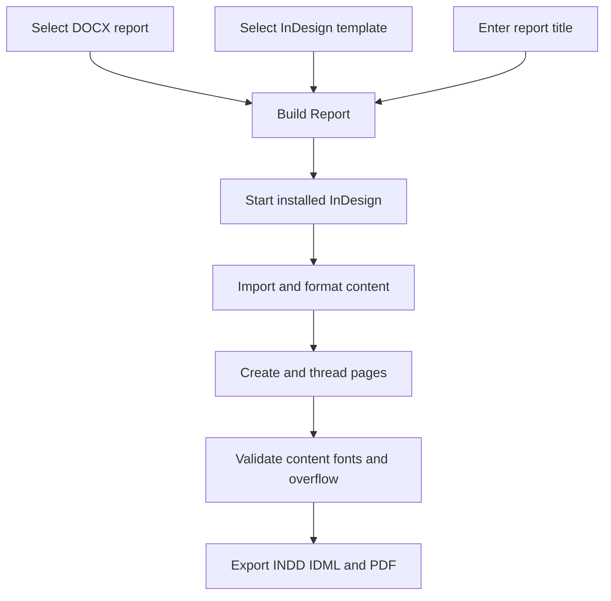

<p align="center">
  
</p>

<h1 align="center">Report Layout</h1>

Report Layout is a Windows desktop utility that converts Microsoft Word reports into editable Adobe InDesign documents. Its English WinForms interface drives an InDesign ExtendScript engine that imports DOCX content, applies Persian typography, flows long text across pages, formats editable tables, validates content, and exports INDD, IDML, and PDF files.

**Current preview:** `v2.0.0-preview.1` · **Last user-tested version:** `v1.1.1` · **Target:** Windows 10/11 and Adobe InDesign 21.3

This preview adds all ten planned feature groups. Portable tests pass, including an InDesign-DOM simulation. Windows compilation and real InDesign execution of the new features have **not** been run in the development environment. Keep v1.1.1 until the [acceptance checklist](docs/TESTING.md) is complete.

## Features

- **Select Reports**, **Select Template**, and **Build Reports**, with editable per-report titles
- **Build Template from PDF**: scans every page of a reference PDF, groups them into the recurring page styles found (ordinary text, chart/exhibit, full-bleed divider, image-only), and generates a fresh `.idml` template with one master spread per style plus a cover (no PDF text or images are copied)
- **Strip Text from PDF**: rebuilds every page of a PDF in InDesign with all text removed, keeping images, charts and rule lines (including stroked lines such as column dividers) in their original positions and sizes — a text-free visual starting point
- **Thread Body Pages**: links the main text frame on each page of an existing `.indd` (e.g. one assembled from separate documents/pages, which InDesign never auto-threads) into one flowing story, over a page range you choose
- Four built-in presets: Economic Report, Book Summary, Research Report, Compact Report
- Editable layout settings, color picker, installed-font dropdowns, JSON preset import/export
- Editable heading-number separator (default `-`, for example `11-2`) and explicit per-report titles
- Word images set to **In Line with Text**, with proportional sizing and configurable frame-relative width/height limits
- Installed PDF presets, including custom names, loaded by Validate Template
- Template validation before every import; separate read-only validation action
- Sequential batch queue, continue-on-error option, and cooperative cancellation of the current report
- Optional editable table of contents with Heading 1/2 and stabilized page numbers
- Cover title, subtitle, author, organization and date; PDF title/author metadata
- Results table with pages, tables, headings, missing fonts, warnings and output buttons
- Local preferences and last queue restored on startup
- Manual or opt-in startup update checks; public GitHub API and authenticated `gh` fallback
- Editable INDD and IDML output plus a review PDF
- Automatic page creation and threaded text flow
- Persian right-to-left formatting with Word `Heading 1` and `Heading 2` mapping
- Native editable tables with repeated first-row headers
- Automatic kashidas set to `None`
- One regular space after numbered heading prefixes
- Text, table-cell, font, and overflow checks
- Supplied logo in the window, executable, taskbar, tray, Desktop, and Start Menu
- Success dialog and tray notification after all required output files are verified
- Source DOCX and template preserved by opening a template copy
- Diagnostic logs and a recoverable review document on failure
- Password-gated sign-in at startup (checked against a stored SHA-256 hash)
- Version number and copyright notice shown in the window footer

## Workflow



## Requirements

- Windows 10 or Windows 11
- .NET Framework (for running the installed application)
- Installed Adobe InDesign; version 21.3 is the target
- Fonts required by the selected template

Microsoft Word, Python, and Node.js are not required on the target computer.

## Installation

1. Download `ReportLayoutPreview-2.0.0-preview.1-Setup.msi` from the latest Release.
2. Run the MSI and follow the prompts; it installs to `Program Files\Report Layout Preview` and creates Desktop and Start Menu shortcuts. The stable v1.1.1 installation, if present, is left intact.
3. Launch **Report Layout Preview** from either shortcut and sign in with the application password.

Building from source instead (`src/*.cs` compiled locally via `Build-and-Run.ps1` / `Start.vbs`) still works for development but is no longer the distributed package; see [Development](#development).

Inline images can be kept and resized, or replaced with empty numbered placeholder frames for manual placement later — toggle **Replace images with placeholders** under **Layout Settings > Images**. Earlier previews shipped this as a separate `Start-Placeholders.vbs` edition; it is now a single normal option in the same app.

## Usage

1. On **Reports**, click **Select Reports** and choose one or more `.docx` files.
2. Keep the bundled template or select an `.idml`, `.indd`, or `.indt` template.
3. Edit each title in the queue; Persian titles are supported. Select the output folder.
4. On **Layout Settings**, apply a preset, then edit individual properties. Use **Choose Color** with the heading/table color selected. To reuse a layout, export/import `layout-preset.json`.
5. On **Cover & Details**, enable/disable the cover and enter subtitle, author, organization and date.
6. Click **Validate Template**. It opens a copy, checks the parent, header, margins, required selected fonts and PDF preset, then closes the copy without saving. It also loads installed PDF preset names without scanning every InDesign font.
7. Select each report row and use **Set Selected Title** (or edit its Title cell directly). A title is required and is used for the cover, running header, metadata and Results row.
8. Click **Build Reports** and leave InDesign documents unchanged until completion. Jobs run sequentially. **Cancel Current Job** requests cancellation at the next safe engine checkpoint, closes the working copy and does not start remaining reports.
8. On **Results**, select a row and use **Open PDF**, **Open INDD**, **Open Folder** or **View Details**. A failed report retains diagnostics; remaining reports follow the continue-on-error option.

### Layout settings and templates

The property grid exposes fonts, type sizes, line/paragraph spacing, heading/table colors, margins, cell padding, borders, header repetition, cover title size, contents options and PDF preset. Sizes are in points; custom margins are in millimetres. Font names use `family<TAB>style`, not a font filename. Validation resolves only the configured fonts to avoid slow or stalled full-library enumeration.

Margin source **Legacy** preserves the previously approved body geometry for `D1-Main Body`. **Template** uses first-page margins; **Custom** uses four explicit values. A blank Parent page name prefers the bundled `D1-Main Body`, falling back to the first page's applied parent. Enter a parent name to require that exact parent.

The border, footer, logo and page-number art remain controlled by the parent in the IDML template. Report text/table formatting comes from the layout settings and overrides matching report paragraph styles on the opened copy. Headings 2-9 still map to the second visual level. Inline images can either be retained and resized or replaced with empty frames, controlled by the **Replace images with placeholders** layout option.

### Table of contents

Enable **Generate table of contents** in Layout Settings. Entries come from Word heading styles, not merely large/bold text. The editable contents is inserted after the cover (or before the body without a cover). Page numbers are recomputed until pagination stabilizes. It is a generated text story, not a native live InDesign TOC or a set of hyperlinks. After manually changing pagination in InDesign, regenerate the report to refresh it. No matching headings is a clear error rather than an empty contents page.

### Preferences and updates

Settings are stored in `%LOCALAPPDATA%\ReportLayoutData\settings.json`, separate from program files. Closing the idle app saves layout, queue paths/titles, template/output, cover details and update preferences. **Save Preferences** saves immediately. Exported layout presets contain formatting only, not report paths or personal metadata.

Update checks are off at startup by default. **Check for Updates** reads the latest stable published release, not arbitrary tags or preview releases. For private repositories, configure GitHub CLI with `gh auth login`; no token is read or stored by this app. The app offers to open a release page and never downloads/runs an update automatically. No report content is sent to GitHub. Network/permission/no-release failures are reported separately from successful checks.

Minimizing hides the application in the system tray. Double-click the tray icon to restore it; use **Exit** in the tray menu to close it.

## Output

| File | Purpose |
| --- | --- |
| `Report.indd` | Primary editable InDesign document |
| `Report.idml` | Interchange copy |
| `Report.pdf` | All-pages review PDF |
| `report-log.txt` | InDesign stages and warnings |
| `result.json` | Machine-readable result |
| `job-config.json` | Inputs and options for the run |
| `layout-preset.json` | Exact effective formatting settings sent by the UI |
| `batch-summary.json` | Per-job outcomes and folders, at the run root |
| `windows-error.txt` | Windows-side error details, on failure |
| `Review-Needed.indd` | Recoverable diagnostic document, when possible |

Success appears only after InDesign reports success and INDD, IDML, and PDF all exist with nonzero size.

Each run has a unique `Run-...` folder containing numbered job folders (`001`, `002`, ...). Validate Template also writes a result/log folder, but does not produce report documents. Results count missing document fonts as warnings after import; required selected fonts are blocking errors. This validation is not the full Adobe Preflight engine.

## Preparing Word

- Use **Heading 1** for main headings and **Heading 2** for subheadings.
- Use **Normal** for body paragraphs.
- Use the first table row for column headings.
- Keep tables structurally simple.

Manual font sizing does not replace Word heading styles. Inline bold in ordinary paragraphs is preserved. Complex Word objects, nested tables, formulas, text boxes, tracked changes, and elaborate notes may need manual review.

### Word images

Set supported images to **In Line with Text** in Word. Under **Layout Settings > Images**, enable image import and choose maximum width and height percentages relative to the report text frame. Oversized inline images are reduced proportionally, remain anchored with their source paragraph, and participate in the normal overflow/page-flow checks. Smaller images are never enlarged. Floating Word images are not repositioned automatically and are reported as warnings; convert them to In Line with Text for predictable output.

The **Replace images with placeholders** option removes each imported graphic but preserves its proportionally constrained anchored frame, numbered for manual placement later. It is an ordinary Layout Settings checkbox, saved with the rest of the layout preset like any other option.

## Preparing another InDesign template

- Turn **Facing Pages** off.
- Put persistent borders, headers, footers, and page numbers on a Parent page.
- Use page margins to define the body area.
- Apply Script Label `REPORT_HEADER` to the running-header Parent text frame.
- Place a `Document fonts` folder beside the template when needed.

The engine removes ordinary page items from the opened copy and builds the report over the selected Parent. It does not save changes to the source template.

## Typography

The bundled workflow uses IRNazanin for body text and Modam for headings, a World-Ready composer, and right-to-left direction. Automatic kashidas are disabled. Tabs and extra whitespace immediately after a numbered heading prefix ending in `)` are replaced with one ordinary space.

## Run the script directly

`Layout-Report.jsx` can run from InDesign without the Windows UI:

1. Open **Window > Utilities > Scripts**.
2. Right-click **User** and choose **Reveal in Explorer**.
3. Copy `Layout-Report.jsx` into the Scripts Panel folder.
4. Double-click it and select the requested inputs.

## Troubleshooting

- Setup failure: send `startup-error.txt` from the extracted package.
- Build failure: send `report-log.txt`, `windows-error.txt`, `result.json`, and the InDesign error screenshot.
- Layout review: send the PDF, IDML, and a **Window > Output > Preflight** screenshot.

## Architecture

| Component | Role |
| --- | --- |
| `src/ReportLayout.cs` | WinForms UI, tray, COM bridge, validation, notifications |
| `src/Settings.cs` | Property-grid schema, presets, validation, persistence |
| `Layout-Report.jsx` | Import, typography, page flow, tables, checks, exports |
| `src/PdfAnalyzer.cs` | Minimal from-scratch PDF object/content-stream reader |
| `src/PdfContentAnalyzer.cs` | Walks a page's content stream for text/fill/image/gradient geometry |
| `src/PdfTemplateSpecBuilder.cs` | Turns that geometry into a margins+colors template spec |
| `Build-Template-From-PDF.jsx` | Builds a Cover + Body-Master `.idml` from a template spec |
| `src/PdfVisualExtractor.cs` | Per-page images/fills/rule lines for the text-free rebuild, with real image export |
| `Build-Visuals-From-PDF.jsx` | Rebuilds every PDF page in InDesign from that extraction, with no text |
| `Thread-Body-Pages.jsx` | Links each page's main text frame, in page order, over a chosen range |
| `Build-and-Run.ps1` | Per-user build-from-source installation, compilation, icon, shortcuts |
| `Start.vbs` / `Start.cmd` | Quiet and fallback launchers for the build-from-source path |
| `installer/Product.wxs` | WiX source for the distributed MSI installer |
| `assets/Template.idml` | Bundled baseline template |
| `assets/ReportLayout.ico` | Multi-size Windows icon |
| `tests/flow-tests.cjs` | Portable engine regression tests |

See [Project Memory](PROJECT_MEMORY.md), [Testing](docs/TESTING.md), and [Changelog](CHANGELOG.md).

## Development

Run portable engine tests with:

```powershell
node tests/flow-tests.cjs
node tests/options-tests.cjs
node tests/engine-tests.cjs
```

These tests do not replace Windows and InDesign acceptance testing.

On Windows, run `powershell -NoProfile -ExecutionPolicy Bypass -File .\tests\Windows-Tests.ps1` to compile and test settings without launching the UI or creating shortcuts. GitHub Actions contains this Windows job; it has not been run from this workspace.

## One-command GitHub publishing

On Windows, install [GitHub CLI](https://cli.github.com/) and run:

```powershell
.\Publish-To-GitHub.ps1
```

Run publishing only inside a real Git checkout with committed changes. The source ZIP does not contain `.git`; copy updated files into your existing checkout, retaining `.git`, then commit first. The script creates a private repository if needed, pushes `main` and the selected tag, packages source/runtime files and publishes a release. Versions with a hyphen are published as prereleases. Existing tags are never moved and existing releases are never overwritten. To publish publicly, use:

```powershell
.\Publish-To-GitHub.ps1 -Visibility public
```

## API references

- [Adobe Document export API](https://developer.adobe.com/indesign/uxp/dom/api/d/document/): PDF export accepts an installed PDFExportPreset.
- [Adobe Application API](https://developer.adobe.com/indesign/uxp/dom/api/a/application/): application PDF preferences and preset collection.
- [GitHub release API](https://docs.github.com/en/rest/releases/releases#get-the-latest-release): published stable-release metadata for update checks.

## Asset and font notice

The template, logo, and font files were supplied for this project. Their inclusion grants no rights beyond their respective licenses. Confirm redistribution rights before public distribution or forking.

## License

No open-source license is assigned. Copyright and redistribution rights remain with their respective owners.
