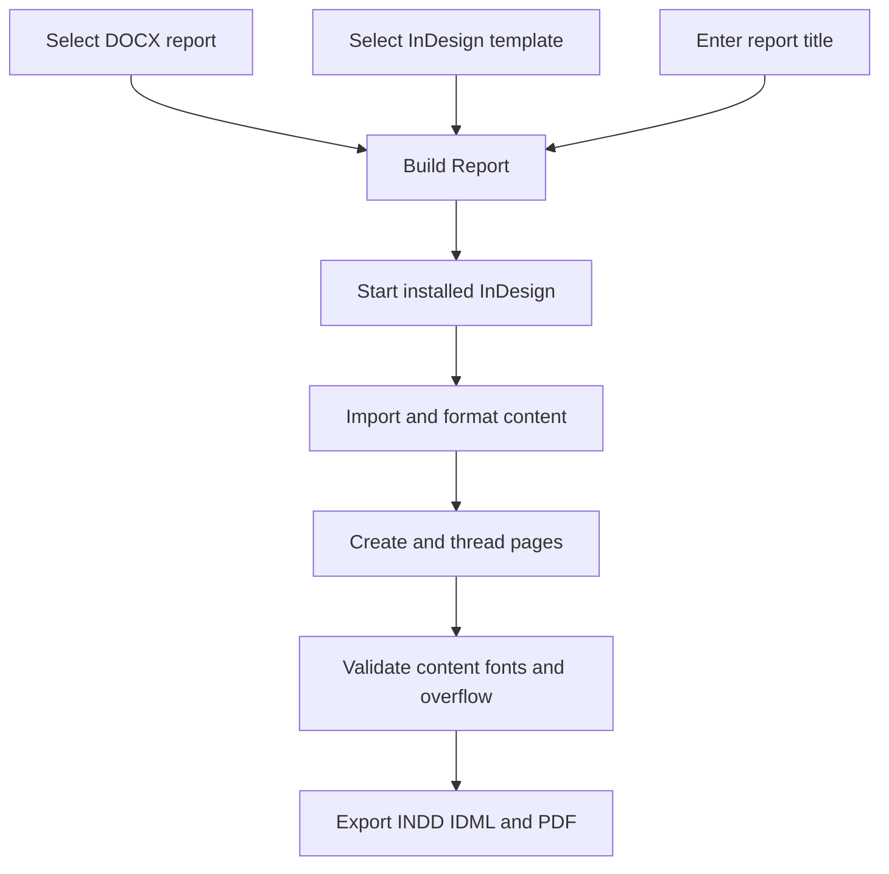

<p align="center">
  
</p>

<h1 align="center">Report Layout</h1>

Report Layout is a Windows desktop utility that converts Microsoft Word reports into editable Adobe InDesign documents. Its English WinForms interface drives an InDesign ExtendScript engine that imports DOCX content, applies Persian typography, flows long text across pages, formats editable tables, validates content, and exports INDD, IDML, and PDF files.

**Current release:** `v1.1.1` · **Target:** Windows 10/11 and Adobe InDesign 21.3

## Features

- Simple **Select Report**, **Select Template**, and **Build Report** workflow
- Editable INDD and IDML output plus a review PDF
- Automatic page creation and threaded text flow
- Persian right-to-left formatting with Word `Heading 1` and `Heading 2` mapping
- Native editable tables with repeated first-row headers
- Automatic kashidas set to `None`
- One regular space after numbered heading prefixes
- Text, table-cell, font, and overflow checks
- Supplied logo in the window, executable, taskbar, tray, Desktop, and Start Menu
- Success dialog and tray notification after all required output files are verified
- Source DOCX and template preserved by opening a template copy
- Diagnostic logs and a recoverable review document on failure
- Password-gated sign-in at startup (checked against a stored SHA-256 hash)
- Version number and copyright notice shown in the window footer

## Workflow



## Requirements

- Windows 10 or Windows 11
- .NET Framework (for running the installed application)
- Installed Adobe InDesign; version 21.3 is the target
- Fonts required by the selected template

Microsoft Word, Python, and Node.js are not required on the target computer.

## Installation

1. Download `ReportLayout-1.1.1-Setup.msi` from the latest Release.
2. Run the MSI and follow the prompts; it installs to `Program Files\Report Layout` and creates Desktop and Start Menu shortcuts.
3. Launch **Report Layout** from either shortcut and sign in with the application password.

Building from source instead (`src/ReportLayout.cs` compiled locally via `Build-and-Run.ps1` / `Start.vbs`) still works for development but is no longer the distributed package; see [Development](#development).

## Usage

1. Click **Select Report** and choose a `.docx` file.
2. Keep the bundled template or select an `.idml`, `.indd`, or `.indt` template.
3. Enter a report title; Persian titles are supported.
4. Select the output folder and choose whether to add a cover page.
5. Click **Build Report** and leave InDesign documents unchanged until completion.
6. After the success message, click **Open Output Folder**.

Minimizing hides the application in the system tray. Double-click the tray icon to restore it; use **Exit** in the tray menu to close it.

## Output

| File | Purpose |
| --- | --- |
| `Report.indd` | Primary editable InDesign document |
| `Report.idml` | Interchange copy |
| `Report.pdf` | All-pages review PDF |
| `report-log.txt` | InDesign stages and warnings |
| `result.json` | Machine-readable result |
| `job-config.json` | Inputs and options for the run |
| `windows-error.txt` | Windows-side error details, on failure |
| `Review-Needed.indd` | Recoverable diagnostic document, when possible |

Success appears only after InDesign reports success and INDD, IDML, and PDF all exist with nonzero size.

## Preparing Word

- Use **Heading 1** for main headings and **Heading 2** for subheadings.
- Use **Normal** for body paragraphs.
- Use the first table row for column headings.
- Keep tables structurally simple.

Manual font sizing does not replace Word heading styles. Inline bold in ordinary paragraphs is preserved. Complex Word objects, nested tables, formulas, text boxes, tracked changes, and elaborate notes may need manual review.

## Preparing another InDesign template

- Turn **Facing Pages** off.
- Put persistent borders, headers, footers, and page numbers on a Parent page.
- Use page margins to define the body area.
- Apply Script Label `REPORT_HEADER` to the running-header Parent text frame.
- Place a `Document fonts` folder beside the template when needed.

The engine removes ordinary page items from the opened copy and builds the report over the selected Parent. It does not save changes to the source template.

## Typography

The bundled workflow uses IRNazanin for body text and Modam for headings, a World-Ready composer, and right-to-left direction. Automatic kashidas are disabled. Tabs and extra whitespace immediately after a numbered heading prefix ending in `)` are replaced with one ordinary space.

## Run the script directly

`Layout-Report.jsx` can run from InDesign without the Windows UI:

1. Open **Window > Utilities > Scripts**.
2. Right-click **User** and choose **Reveal in Explorer**.
3. Copy `Layout-Report.jsx` into the Scripts Panel folder.
4. Double-click it and select the requested inputs.

## Troubleshooting

- Setup failure: send `startup-error.txt` from the extracted package.
- Build failure: send `report-log.txt`, `windows-error.txt`, `result.json`, and the InDesign error screenshot.
- Layout review: send the PDF, IDML, and a **Window > Output > Preflight** screenshot.

## Architecture

| Component | Role |
| --- | --- |
| `src/ReportLayout.cs` | WinForms UI, tray, COM bridge, validation, notifications |
| `Layout-Report.jsx` | Import, typography, page flow, tables, checks, exports |
| `Build-and-Run.ps1` | Per-user build-from-source installation, compilation, icon, shortcuts |
| `Start.vbs` / `Start.cmd` | Quiet and fallback launchers for the build-from-source path |
| `installer/Product.wxs` | WiX source for the distributed MSI installer |
| `assets/Template.idml` | Bundled baseline template |
| `assets/ReportLayout.ico` | Multi-size Windows icon |
| `tests/flow-tests.cjs` | Portable engine regression tests |

See [Project Memory](PROJECT_MEMORY.md), [Testing](docs/TESTING.md), and [Changelog](CHANGELOG.md).

## Development

Run portable engine tests with:

```powershell
node tests/flow-tests.cjs
```

These tests do not replace Windows and InDesign acceptance testing.

## One-command GitHub publishing

On Windows, install [GitHub CLI](https://cli.github.com/) and run:

```powershell
.\Publish-To-GitHub.ps1
```

The script signs in when needed, creates a private `report-layout` repository, pushes `main` and the selected version tag, builds the Windows ZIP and checksum, and publishes the GitHub Release. To publish publicly, use:

```powershell
.\Publish-To-GitHub.ps1 -Visibility public
```

## Asset and font notice

The template, logo, and font files were supplied for this project. Their inclusion grants no rights beyond their respective licenses. Confirm redistribution rights before public distribution or forking.

## License

No open-source license is assigned. Copyright and redistribution rights remain with their respective owners.
